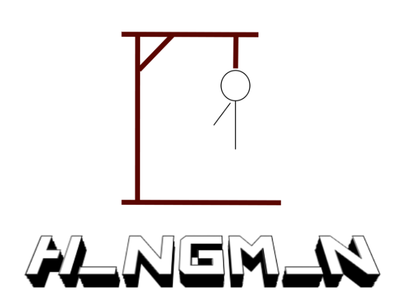

    
  
  # **HangMan**
   
  ## **DESCRIPTION**
  Hangman is a recreation of the classic word guessing game where you have six tries to guess the word which you are given the length and category of. This version of the game includes two difficulty levels, and a highscore function. How many rounds can you go?
  

  COLOR PALETTE            |  DEMO
:-------------------------:|:-------------------------:
   |  <video width = 100% controls><source  src="hangmandemo.mp4" type="video/mp4">DEMO Video</video> 

## **KEY FEATURES:**
The hangman program consists of two difficulty levels, normal and hard. The normal level allows the user to have more guesses than the hard mode. The program also keeps track and displays the high score of the user. There is also a round function that allows the user to play multiple rounds without having to restart the game after a win. 

## **HOW TO USE (Visual Studio Code)**
The first thing you will do after running the code is pick your difficulty level. After that you will get an empty play area which is a hint of what your word could be. You will also see a menu with the options of guessing the letter, guessing the word, or quit the program altogether. After picking one of these options you will either be given a space to type out your answer or the program will end
